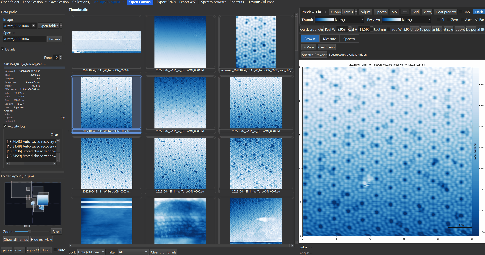

# Filters & Processing

{ width="900" }

SXM Viewer ships a fixed set of 10 named image filters, applied non-destructively - the original data is always preserved, and a processed view is stored alongside it.

---

## Applying a single filter

Right-click the preview or a pop-out -> **Filters** submenu, or use the thumbnail context menu for batch application to selected thumbnails. The submenu shows a **"Current: ..."** status line describing any pipeline already active on that image, then all 10 filters individually (each opens its own small parameter dialog before applying), then **Custom pipeline...** and **Clear filter**.

!!! warning "Clicking a filter adds a step - it doesn't replace the current one"
    If a filter is already active, clicking another filter from this menu **appends** it as a new pipeline step rather than replacing the existing one (the menu even relabels itself "Add step: ..." once something is active). Applying Laplacian, then later applying Low-pass from the same menu, leaves you with a two-step Laplacian-then-Low-pass pipeline, not a low-pass-only result. Use **Clear filter** first if you want to start over with a single filter instead of stacking.

---

## Available filters

| Filter | What it does | Parameters |
|---|---|---|
| Flatten (row/col median) | Subtracts the per-row and/or per-column median to remove offset/striping | Axis: both / row / col |
| Tilt correction (plane) | Subtracts a best-fit 1st-order plane (`ax+by+c`) | none |
| Global plane fit (2nd order) | Subtracts a best-fit 2nd-order surface (`ax²+by²+cxy+dx+ey+f`) | none |
| Line-by-line flatten | The standard STM fix for row-to-row "sawtooth"/1/f-noise stripe artifacts | Axis: row / col / both; Method: median / mean / poly1 / poly2 |
| High-pass (Gaussian) | Removes low-frequency background, keeping fine detail | Sigma |
| Low-pass (Gaussian) | Smooths/denoises by removing high-frequency detail | Sigma |
| Laplacian | Highlights edges and fine surface features via the second spatial derivative | Sigma (pre-smoothing); Stencil (4- or 8-neighbor); Absolute response (\|∇²f\| vs. signed) |
| Logarithmic (dynamic range) | Compresses a wide dynamic range so faint and strong features are both visible | Epsilon (offset, as a fraction of the data range) |
| Histogram equalization | Redistributes intensities for maximum contrast | none |
| CLAHE (adaptive equalization) | Localized, tile-based histogram equalization - requires scikit-image | Clip limit (0.001-0.5); Tile size (4/8/16/32) |

High-pass and Low-pass are greyed out with an explanatory tooltip if no Gaussian backend (SciPy/OpenCV) is available. Laplacian's optional pre-smoothing silently skips smoothing instead of warning you if no backend is present - if edge highlighting looks unexpectedly sharp, this may be why.

**Only Low-pass, High-pass, and Laplacian remember their last-used parameters across sessions.** The other seven filters always reopen with their default parameters.

---

## Custom pipeline

**Filters -> Custom pipeline...** opens a dialog to chain multiple filter steps into a single processing pipeline, previewed before committing.

!!! warning "Not every filter has adjustable parameters here"
    The Custom pipeline dialog currently only exposes parameter controls for **Flatten, High-pass, Low-pass, and Laplacian**. Adding any of the other six filters (Tilt correction, Global plane fit, Line-by-line flatten, Logarithmic, Histogram equalization, CLAHE) as a pipeline step uses their hard-coded defaults (e.g. CLAHE always applies clip limit 0.03 / tile size 8) with no way to adjust them in this dialog. If you need non-default parameters for one of those six, apply it individually first via the single-filter menu (which does have full parameter controls), then build the rest of the pipeline around it.

There is currently no way to save a custom pipeline as a named, reusable preset - the "Name prefix" field in this dialog is a cosmetic label shown in the pipeline summary and thumbnail badge, not a saved preset you can recall later for a different image.

Every filter step - whether from the quick menu or the custom pipeline - runs only over the automatically-detected valid scan region, leaving invalid border rows (common on aborted or partial scans) untouched.

---

## Applying filters to multiple images

Select several thumbnails (Shift+Click, Ctrl+Click, or drag rubber-band) then right-click -> **Filters** to batch-process all selected images with the same filter and parameters. The context menu gains a **Clear filter (selected)** action when multiple thumbnails are selected.

!!! note "Undo works differently here"
    ++ctrl+z++ undoes a filter step when it was applied through the preview/pop-out canvas's own Filters menu. Batch-applying a filter from the **thumbnail** context menu does not push anything onto that undo stack - to remove it, use **Clear filter** / **Clear filter (selected)** instead of Ctrl+Z.

---

## Filters and the rest of the workspace

- A small **"Filter: ..."** badge appears in the corner of a filtered view whenever a pipeline is active, so it's always visible which images have processing applied.
- Filter state is saved with sessions, so reopening a session restores every image's filter pipeline exactly as it was.
- Applying or changing a filter automatically recomputes the display contrast range for the new, filtered data - see [Histogram & Contrast](histogram.md) for how this interacts with a manually-set histogram range.
