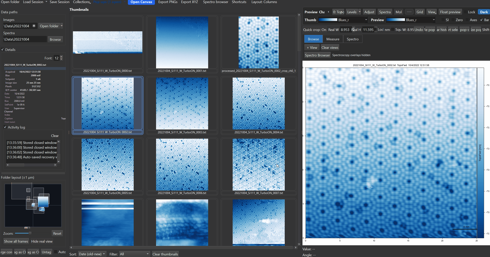

# Histogram & Contrast

SXM Viewer includes histogram-based range controls for adjusting image contrast without changing the underlying data.

{ width="900" }

---

## Opening the histogram tool

Use the image display controls or the relevant right-click menu entry to open the Histogram & Range dialog for the current preview or pop-out. If more than one view is open in that window, a **view selector** drop-down at the top lets you switch which one the dialog is editing.

The dialog shows a live 256-bin histogram of the current view's data. Below it:

- **Min** / **Max** spin boxes - type an exact display range
- Two draggable lines directly on the histogram plot - click and drag either one to set min/max visually
- **Live preview** checkbox (on by default) - applies range changes to the image immediately as you adjust them, instead of only on Apply
- **Auto (1-99%)**, **Reset**, and **Apply** buttons

---

## Auto vs. Reset - these do different things

This is the single most important distinction on this page, and it's easy to mix up:

- **Auto (1-99%)** sets the display range to the **1st-to-99th percentile** of the currently displayed data - a robust contrast stretch that ignores extreme outliers (a few dead pixels or a scan-edge artifact won't wash out the rest of the image).
- **Reset** sets the display range to the **true finite min/max** of the currently displayed data - no percentile clipping at all, so a single extreme outlier pixel *will* dominate the range.

Both operate on the view **as currently displayed** - if a filter is active, they read the filtered data's histogram, not the original file's.

!!! tip
    If Auto still looks washed out because of one bad pixel, that's expected - the 1-99% clip already excludes the most extreme 2% of values. If you want the literal min/max instead (e.g. to see exactly how far an outlier goes), use Reset instead of Auto.

---

## Interaction with other tools

Histogram edits are display operations, not destructive processing. They work alongside relative-zero display, colorbar orientation, profiles/overlays, and popup-specific view state.

Opening the histogram dialog temporarily disables profile-line creation/editing on the canvas underneath it (so dragging on the histogram plot can never be mistaken for drawing a profile line), and restores whatever profile mode was active once the dialog closes.

!!! warning
    Applying or changing a filter (see [Filters & Processing](filters.md)) automatically recomputes the display range for the new, filtered data - so a manually-set histogram range can be silently replaced if you apply a filter afterward. If you want a specific range to stick, set it again after your filter pipeline is finalized.

---

## Tips

!!! tip
    If an image looks washed out, first try the histogram/range dialog before applying a filter.

!!! tip
    For constant-height images, test histogram changes together with ++0++ relative-zero mode, since that can produce a more interpretable zero-anchored colorbar.

---

## Related pages

- [Colormaps & Contrast](../workspace/colormaps.md)
- [Preview & Popups](preview-and-popups.md)
- [Filters & Processing](filters.md)
