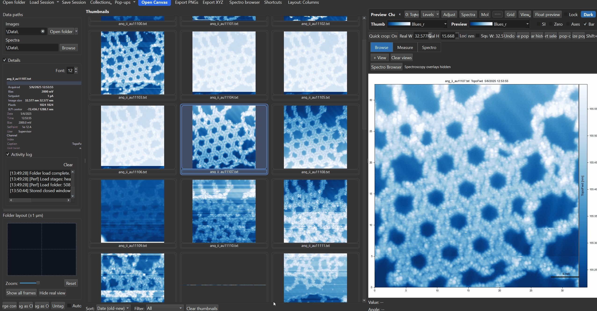
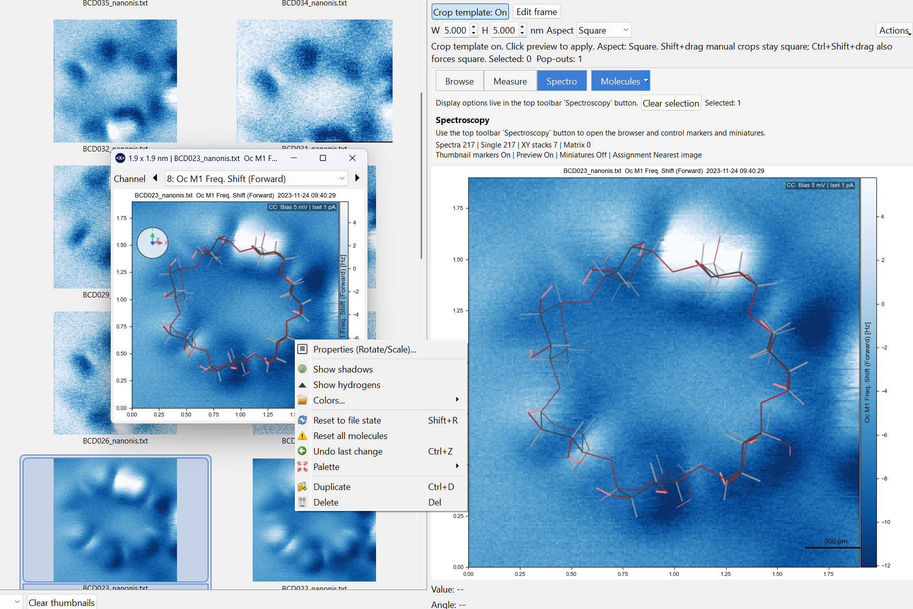
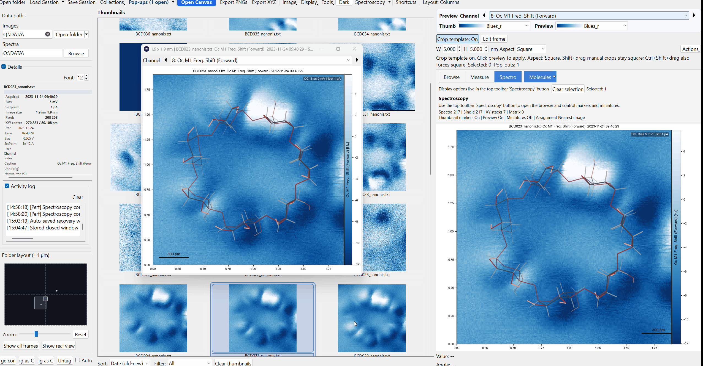

# Molecule Overlays

Molecule overlays let you place and manipulate molecular models directly on preview canvases, pop-outs, and canvas tiles. SXM Viewer has two independent molecule-overlay systems: a **3D model** overlay (this page's main content, below) and a **2D structure** overlay for SVG/Mol/SDF/XYZ files with its own styling controls (see [2D Structure Overlays](#2d-structure-overlays) further down).

{ width="900" }

---

## Showing molecules

Molecule overlays can be toggled from the main lower workspace row, from **Display**, and from right-click menus. They are part of the normal overlay system and can be shown or hidden without reloading the underlying image.

Saved molecule state is preserved with sessions and other workspace snapshots.

---

## Loading a molecule

Use the **Molecules** control in the lower workspace row to toggle overlays or open the molecule menu. The same actions are also available from canvas right-click menus.

Typical actions include:

- show or hide molecules
- load a molecule file
- load a recent molecule
- clear molecules from the current image

On normal preview and pop-out canvases, molecule visibility is part of the shared display-state system.

---

## Selecting and rotating molecules

Once a molecule is selected:

| Shortcut or gesture | Action |
|---|---|
| Click molecule | Select molecule |
| ++x++ | Rotate around X |
| ++y++ | Rotate around Y |
| ++z++ | Rotate around Z |
| ++shift+x++ / ++shift+y++ / ++shift+z++ | Rotate in the opposite direction |
| ++shift++ + drag | Rotate around Z |
| ++ctrl++ + ++shift++ + drag | Rotate in X/Y |
| Middle-button drag | Rotate in X/Y |

---

## Molecule gizmo

The molecule gizmo is a small orientation widget for the selected molecule.

{ width="700" }

- It appears temporarily when you select, move, or rotate a molecule.
- It can be kept visible through **Display -> Show Molecule Gizmo**.
- It follows the current X/Y/Z rotation state of the active molecule.

The gizmo is also interactive:

- dragging the inner area rotates the molecule in **X/Y**
- dragging the outer ring rotates the molecule around **Z**

{ width="900" }

---

## Reset to file state

If you want to discard molecule edits and return to the original file-derived orientation and properties:

- right-click the selected molecule -> **Reset to file state**
- or press ++shift+r++

This reloads the molecule from its source file and clears overlay edits such as rotation or appearance overrides, while keeping the current on-canvas placement.

---

## Overlay behavior

Molecule overlays are tied to the current image state rather than being a purely global decoration. In particular:

- preview and pop-outs can show or hide them through display state
- virtual copies default to their own molecule state
- sessions can preserve molecule overlays
- copy and clear actions exist for thumbnail and canvas workflows

---

## Default appearance

New overlays start in a bond-only display mode with the PyMol palette selected by default.

---

## 2D Structure Overlays

A separate overlay type for placing a flat, 2D chemical structure (from an SVG, `.mol`, `.sdf`, `.xyz`, `.cdxml`, or `.cml` file) on top of an image - useful for annotating a scan with a reference structure diagram rather than a 3D ball-and-stick model.

### Loading

Use **Molecules -> Load 2D Structure...** to place one, or **Load Recent 2D Structure** to reuse one you've placed before. **Clear 2D Structures** removes all 2D overlays from the current view.

### Editing and positioning

Right-click a placed 2D structure for its full menu:

| Action | What it does |
|---|---|
| Per-atom edit mode | Toggle dragging individual atoms to adjust bond lengths/angles |
| Set reference bond length... | Calibrate the structure's scale against a known bond length |
| Style (colors, text, bond order)... | Open the style dialog (below) |
| Duplicate | Add a copy of the structure |
| Delete | Remove this structure |

Once selected, arrow keys nudge the whole structure by small increments.

### Style dialog

The **Style (colors, text, bond order)...** action opens one consolidated dialog for every visual option, applied live so you can see the effect immediately:

**Atoms** - choose a color palette (CPK, Jmol, PyMOL, Avogadro, ASE) or a flat single color for every atom.

**Bonds**:

- **Show bond order** (double/triple bonds) - off by default. This reflects the source file's assumed bonding, often a gas-phase reference structure; bonding and aromaticity can change once a molecule is adsorbed on a surface, so enable it only when the structure is meant as an idealized reference, not a measured one.
- **Show bond-length labels** - print each bond's length on the image.
- **Color bonds** - uniform (default), by length using a continuous colormap, by length using discrete short/normal/long categories, or by bond order. The continuous mode only offers sequential/diverging colormaps (appropriate for an ordered quantity); the categorical mode only offers qualitative colormaps, with ColorBrewer's documented colorblind-safe schemes (`Dark2`, `Paired`, `Set2`) flagged in the list.
- **Show color legend on the image** - adds a small on-image key explaining what the bond colors mean, useful when sharing a figure with someone unfamiliar with these conventions.

**Text** - a text-size multiplier, and a high-contrast option (thicker text outline) for busy backgrounds or low-vision accessibility.

**Presets** - **Save as default** applies the current style to every new 2D structure you load from then on; **Save preset.../Load preset...** save/load a style to/from a file, for sharing or reusing across sessions.

### Exporting

The right-click **Export** submenu covers: the edited structure file, XYZ coordinates only, a bond-length histogram, the current canvas as PNG, the overlay alone as a transparent PNG, and **Clean scheme with bond lengths...** - a publication-style rendering of just the structure and its bond-length annotations, without the underlying scan image.

---

## Related pages

- [Overlays](../workspace/overlays.md)
- [Publication Canvas](../workspace/canvas.md)
- [Sessions & Collections](../browsing/sessions-and-collections.md)
