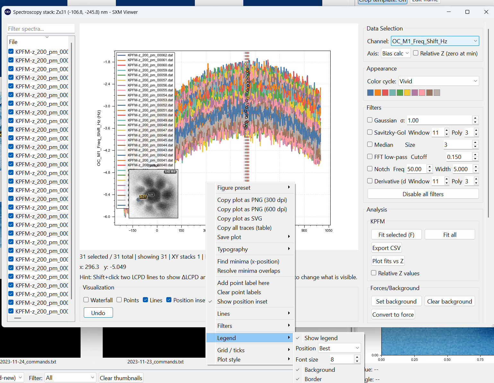

# Spectroscopy Browser

The Spectroscopy Browser is a searchable, filterable **tree** of every spectroscopy trace associated with the current workspace - organized hierarchically as **Image -> Site -> Trace**, not a flat table.

{ width="900" }

---

## What it shows

Open the browser from the toolbar. Each top-level entry is a source image; underneath it, spectra are grouped into **sites** (locations that were measured, possibly repeatedly or as a Z-stack) and finally individual **traces**.

This is useful when you want to:

- see at a glance which images have associated spectroscopy, and how much
- search across image/site/file/channel/position instead of scanning the thumbnail grid
- open several related traces into the same comparison plot

### Search and filters

- A **search box** filters the tree live by image name, site, file, channel, or position text.
- Four checkboxes narrow the tree further: **Current image** (only spectra tied to the image currently shown in the main preview), **Z-stacks**, **Matrix**, and **Low confidence** (spectra whose automatic image assignment - see [Spectroscopy Overview](overview.md#assignment-sites-and-stacks) - wasn't confident).

---

## Common actions

Right-click an entry in the tree for:

- **Open** - opens the trace in a spectroscopy popup
- **Assign to current image** - manually attaches this spectrum to whichever image is currently displayed, overriding the automatic assignment
- **Clear manual assignment** - reverts to the automatic assignment

Selecting several entries (Shift/Ctrl-click) and opening them feeds a **shared comparison plot** instead of opening one popup per trace - see [Spectroscopy Overview](overview.md) for the comparison workflow this leads into.

---

## A separate, per-file dialog: Spectro Summary

Right-clicking a thumbnail's spectroscopy miniature (or certain "show spectros for this file" actions) opens a different, **per-file** dialog - a small modal listing just that file's own spectroscopy entries, with its own preview thumbnail, channel selector, marker-color picker, and (for matrix files) a colormap combo. This is a lighter-weight, single-file complement to the global searchable browser above, not the same window.

---

## Relationship to thumbnail markers

The browser complements the thumbnail-grid workflow rather than replacing it.

Use:

- the **thumbnail grid** when you want image-first navigation with spatial context (see [Thumbnail Grid](../browsing/thumbnail-grid.md) for the marker symbols, low-confidence indicator, and stack badges drawn there)
- the **browser** when you want to search/filter across everything at once, independent of which image is currently on screen

---

## Plot controls

Once a trace or comparison is open in a spectroscopy popup, it supports a richer set of display controls, including:

- grid, line, point, and dark-background toggles
- per-trace styling for colour, thickness, and line style
- legend editing for position, font size, background, and border
- smoothing and derivative filters
- typography and export or copy actions
