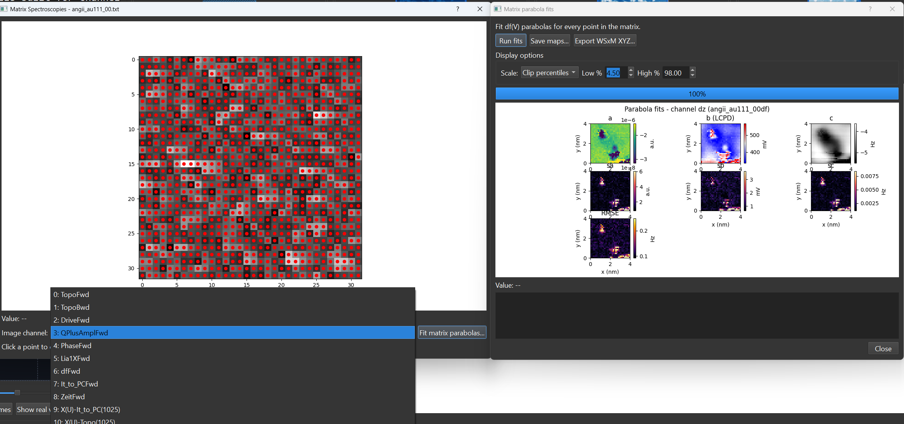

# Matrix Scans

{ width="900" }

A **matrix scan** (also called grid or CITS-style spectroscopy) stores many spectra sampled across a spatial grid over an image, rather than a single point. SXM Viewer reconstructs and displays these grids in a dedicated **Matrix Spectroscopy Viewer**.

---

## Opening a matrix dataset

Matrix datasets appear alongside single-point spectra in the thumbnail grid and the [Spectroscopy Browser](browser.md), flagged so you can filter for just matrix entries. Opening one launches the Matrix Spectroscopy Viewer.

---

## The matrix viewer

The viewer shows a grid of acquisition positions over a reference image, with tools to turn the whole grid into a 2D map or drill into individual spectra:

- **Reference image** - pick which real scan channel to display underneath the grid of positions.
- **Channel map** / **Map mode** - reconstruct a 2D per-pixel map from the matrix stack using one of three aggregations: **Max amplitude**, **Peak position**, or **Integral**.
- **Show all spectroscopy positions** - toggle every grid point on/off over the reference image.
- **Color cycle** - the palette used for plotted traces.
- An info label showing point count, grid dimensions, the X/Y range in physical units, and the acquisition time span at a glance.

### Selecting and plotting positions

Click a grid position to plot its spectrum. Click additional positions to build a multi-selection - each one is added to a selection table (channel, X, Y in nm) alongside a shared comparison plot, so you can visually compare spectra from different points in the grid.

- **Export selection to CSV** writes every selected spectrum as a long-format table (`channel, index, x_nm, y_nm, bias, bias_unit, value` - one row per point per bias step).
- **Clear selection** empties the table and comparison plot.

### Right-click canvas menu

Right-clicking the grid canvas exposes: marker style (circle/square/diamond/triangle/cross), marker size (several presets, or a custom size), marker fill/edge color, typography (font family/style), **Clear selections**, and **Reset view**.

---

## Matrix-wide fitting

The **Fit matrix parabolas...** button runs the same quadratic bias-spectroscopy fit used elsewhere (see [Parabola Fits](parabolas.md)) independently at **every pixel** in the grid, producing a set of 2D fit-parameter maps (including the LCPD map) - see [KPFM Data](kpfm.md#matrix-wide-fitting) for the dedicated dialog this opens and what each output map means.

---

## Related pages

- [Spectroscopy Overview](overview.md)
- [Spectroscopy Browser](browser.md)
- [Parabola Fits](parabolas.md)
- [KPFM Data](kpfm.md)
- [Supported File Formats](../reference/file-formats.md)
