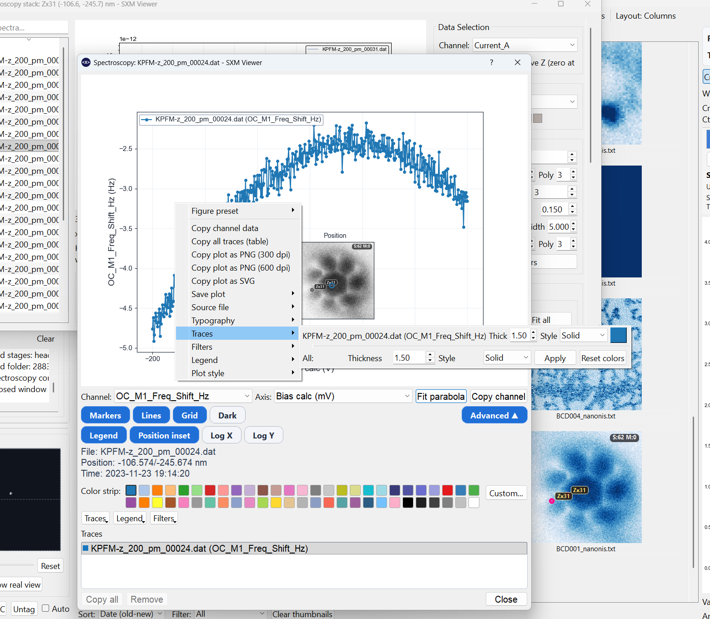
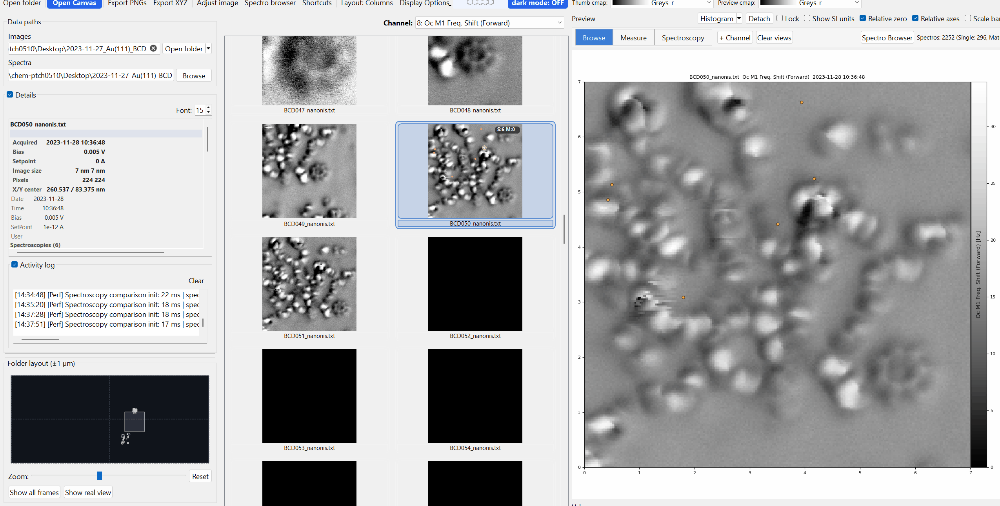

# Spectroscopy Overview

SXM Viewer loads spectroscopy files automatically when a folder is opened, associating them with images using robust timestamp-based matching. Spectroscopy data and scan images live in the same workspace rather than requiring separate tools.

{ width="900" }

---

## Spectroscopy thumbnails

Associated spectroscopy files appear as **miniature thumbnails** within the main thumbnail grid, positioned near their spatially associated scan image. Markers on the scan thumbnails indicate where each spectroscopy was acquired.

### Thumbnail marker customisation

Right-click a spectroscopy thumbnail -> **Miniature channel** to choose which channel drives the miniature plot. Marker size, colour, and symbol are also customisable for better visibility on different backgrounds.

### Selection

| Gesture | Effect |
|---|---|
| Single click | Select spectroscopy |
| Shift+Click | Range-select |
| Ctrl+Click | Add or remove from selection |
| Drag | Rubber-band selection |
| Double-click | Open spectroscopy popup |

### Right-click actions

Right-clicking a spectroscopy thumbnail exposes more than just channel selection: **Open spectroscopy**, **Open site summary**, **Compare this site** (opens a multi-trace comparison for every spectrum at that location), **Show metadata in Details**, **Assign to current image (&lt;name&gt;)** / **Clear manual assignment** (see [Assignment, sites, and stacks](#assignment-sites-and-stacks) below), plus the Source file submenu.

---

## Assignment, sites, and stacks

Every spectroscopy file is automatically matched to the scan image it most likely belongs to, using spatial and timestamp proximity. Behind that simple appearance, spectra are actually organized into a small hierarchy:

- **Sites** - physical locations that were measured, grouping repeated or nearby spectra together.
- **Stacks** - a site measured repeatedly, e.g. at different tip heights (a Z-stack).
- **Assignment confidence** - each auto-assignment carries a confidence level; a spectrum matched less certainly to its image is flagged as **low confidence** and drawn differently on the thumbnail marker (see [Thumbnail Grid](../browsing/thumbnail-grid.md)) and can be filtered for specifically in the [Spectroscopy Browser](browser.md).

If an automatic assignment is wrong, right-click the spectroscopy thumbnail (or its entry in the browser tree) and choose **Assign to current image** to manually attach it to whichever image is currently displayed, or **Clear manual assignment** to revert to the automatic match.

---

## Spectroscopy browser

Open the **Spectroscopy Browser** from the toolbar for a searchable, filterable tree of every associated spectrum, organized as Image -> Site -> Trace - see [Spectroscopy Browser](browser.md) for the full search/filter controls and a note on the separate per-file Spectro Summary dialog.

---

## Spectroscopy popup

The spectroscopy popup uses the same general layout style as the profile-measurement window: plot on top, control strip underneath, advanced controls on demand, and a trace list below.

It can display one spectrum or several overlaid traces in the same window.

{ width="900" }

{ width="900" }

### Core controls

The main popup keeps the high-frequency controls visible:

- **Channel**
- **Axis**
- **Fit parabola** - fits the trace to a quadratic and reports its coefficients, RMSE, and the fit's vertex position (labeled **LCPD** - local contact potential difference - since this fit is most often used on bias-spectroscopy/KPFM data). See [Parabola Fits](parabolas.md) for what these numbers mean and how the same fit is used for batch and matrix-wide fitting.
- **Copy channel**
- toggles for **Markers**, **Lines**, **Grid**, and **Dark**

### Advanced controls

The **Advanced** section exposes:

- **Legend** toggle
- **Position inset**
- **Log X / Log Y**
- colour swatches for the active trace
- menus for **Traces**, **Legend**, and **Filters**

### Trace styling

The popup supports per-trace visual editing without needing the full comparison dialog:

- change trace colour
- change line thickness
- change line style
- apply a style to all traces
- reset trace colours to the active palette

The trace list also supports right-click styling for the currently selected trace.

### Legend editing

The popup legend supports:

- show or hide
- position
- font size
- background on or off
- border on or off

### Filters

Single-spectrum popups can now apply the same core signal-processing stack used in the comparison workflow:

- Gaussian smoothing
- Savitzky-Golay smoothing
- Median filtering
- FFT low-pass
- Notch filtering
- first derivative `dY/dX`

These are display and analysis filters for the plotted traces; they do not rewrite the source file.

### Typography and export

Font family, bold, italic, and underline are accessible from the right-click **Typography** menu and stay consistent with the rest of the GUI.

Right-click the spectroscopy plot for:

- PNG, SVG, and PDF export
- direct data-copy actions
- trace styling
- legend editing
- source-file actions

---

## Source-file actions

Both spectroscopy thumbnails and spectroscopy popups expose a **Source file** submenu so you can:

- show the underlying file in the operating-system file manager
- open the file in the default text editor for the current OS
- copy the full file path

---

## Spatial markers on images

When spectroscopy display is enabled, markers appear on the preview and pop-outs at the acquisition positions. Toggling spectroscopy on or off does not reload the data; the association is cached.

Marker positions are correctly placed in both absolute and relative axes display modes.

---

## Supported spectroscopy types

- Single-point I(V), I(z), df(V), df(z) traces
- Grid or matrix spectroscopy (see [Matrix Scans](matrix.md))
- KPFM data (see [KPFM](kpfm.md))
- Parabola fits, used across single-spectrum, batch, and matrix-wide workflows (see [Parabola Fits](parabolas.md))
