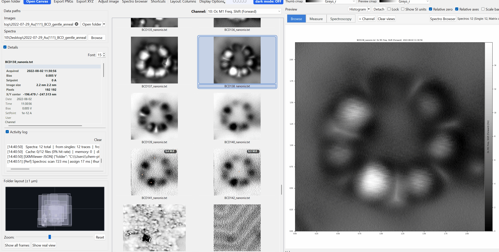

# Publication Canvas

{ width="900" }

The **Canvas** is a multi-image figure composer for building publication-ready layouts from your SPM data.

Open it with the **Canvas** toolbar button (SXM Viewer has no menu bar/File menu - the toolbar button is the only entry point).

---

## Adding images

Drag thumbnails from the main grid onto the canvas to add them as tiles. Each tile is an independent image with its own colormap, contrast, overlays, and display state.

---

## Navigating the canvas

- **Rubber-band drag** on empty canvas space to select multiple tiles.
- **Click-drag** on empty space to pan the view.
- **Ctrl + scroll wheel** to zoom.
- **Arrow keys** nudge the selected tile(s) by a small step; hold **Shift** for a larger (10px) step.
- **Ctrl+A** selects all tiles; **Escape** clears the selection.
- Tiles themselves are moved/resized/rotated directly by dragging their body or handles; **Alt+drag** a tile to duplicate it.

---

## Layout

There is no free-form "stack" or "column" arrangement - the canvas offers three fixed grid presets, available both as toolbar buttons and from the right-click **Layout** submenu:

- **2x2**
- **1x3**
- **3x1**

Outside of these presets, tiles are positioned freely: drag a tile's body to move it, drag its corner/edge handles to resize it, and use its rotate handle to rotate it - there is no separate "reorder" list.

---

## Per-tile overlay chips

When a tile is selected, overlay chips appear directly on it for instant toggling:

| Chip | Toggles |
|---|---|
| T | Tile title |
| S | Scale bar |
| C | Colorbar |
| M | Metadata bar |
| U | Unit badge |
| F | Filename badge |

Each chip updates the tile immediately, saves to undo history, and keeps the inspector in sync.

---

## Display presets

The canvas toolbar offers three global presets:

| Preset | Description |
|---|---|
| Clean | No title, no overlay info, no metadata/unit bar, no colorbar; scale bar on |
| Analysis | Title, scale bar, and a right-positioned colorbar with ticks on; metadata bar and overlay info turned **off** |
| Publication | Same toggle set as Clean |

!!! note
    As currently implemented, **Clean** and **Publication** produce identical results - if you're trying to tell them apart by their effect on a tile, you won't see a difference. Use whichever name fits your workflow, or set toggles manually and let the state read **Custom**.

Making any manual display change marks the state as **Custom**.

---

## Right-click canvas menu

Right-clicking a **tile** exposes:

**Range**
: Auto-range selected tiles, copy range to selected, sync ranges across tiles.

**Colormap**
: Copy colormap to selected, common colormap presets, sync colors by channel across tiles.

**Display**
: Show/hide metadata bar, unit badge, title, colorbar, colorbar ticks, scale bar, colorbar position.

**Alignment**
: Align selected, align by channel, reset alignment.

**Layout**
: The same 2x2 / 1x3 / 3x1 presets as the toolbar buttons.

Right-clicking **empty canvas space** instead offers: Select All, Deselect All, Zoom In, Zoom Out, Reset Zoom, Fit All in View, and - when tiles are selected - **Copy selected as SVG**, **Save selected as SVG...**, **Save selected as PDF...** (see [Export](#export) below).

---

## Molecule overlays on canvas

The canvas left rail includes molecule controls: **Show**, **Load onto selected**, and **Clear from selected**. Canvas tiles carry molecule overlay state and render it directly.

---

## Export

The toolbar **Export** button renders the whole composed canvas as a flattened raster image - **PNG, JPEG, or PDF**. There is no SVG option here.

Vector (SVG) export works differently and lives in the right-click menu instead: select one or more tiles, then use **Copy selected as SVG** or **Save selected as SVG...** from the empty-space right-click menu. With multiple tiles selected, saving to a folder writes one SVG file per tile, while copying composes them into a single multi-tile SVG document. See [Export to SVG & PDF](../export-and-sharing/vector.md).

!!! warning
    There is currently no PowerPoint export from the Publication Canvas. PowerPoint sending is only available from the main preview, pop-outs, and the thumbnail grid - see [Export to PowerPoint](../export-and-sharing/powerpoint.md).
